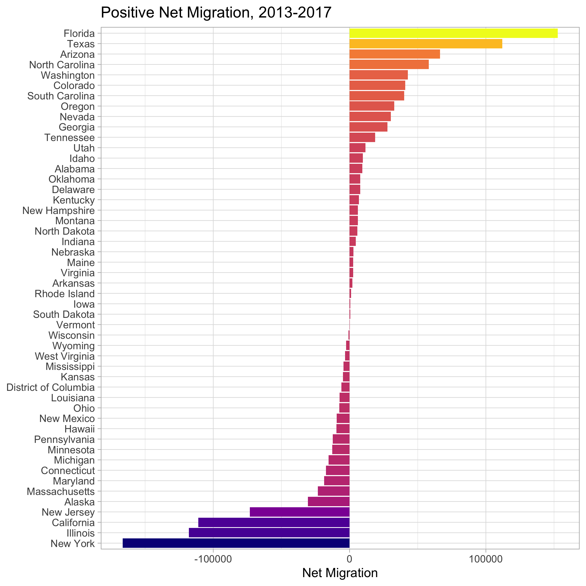
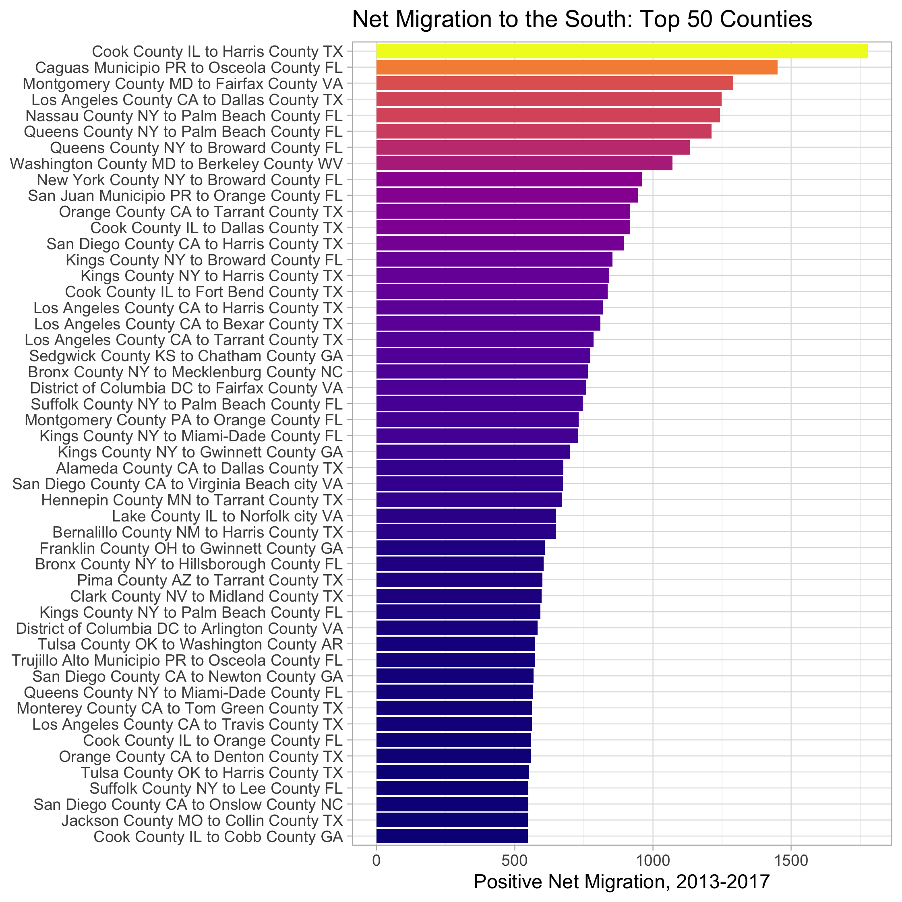
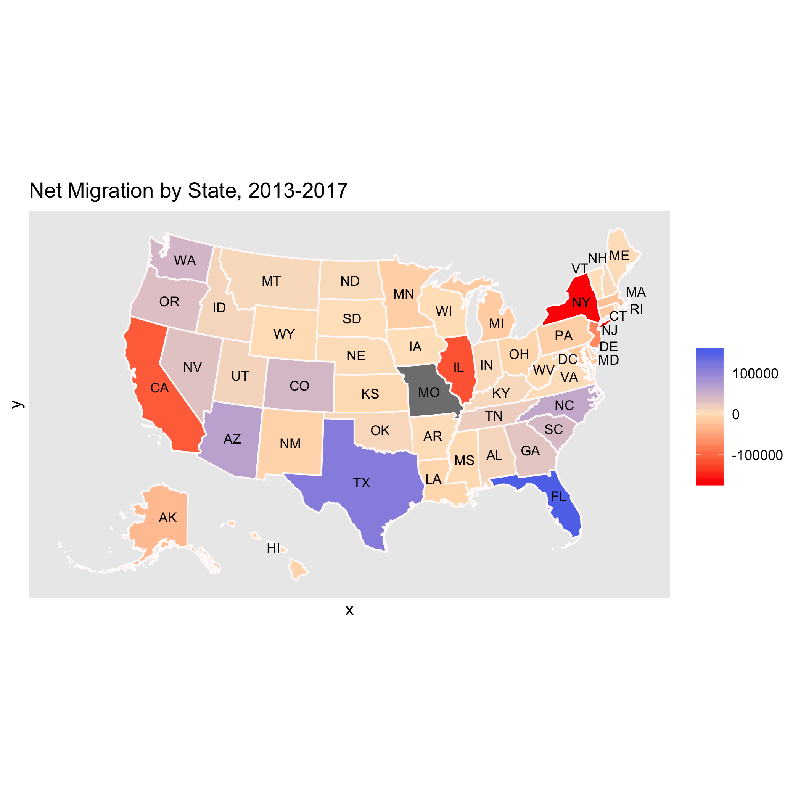
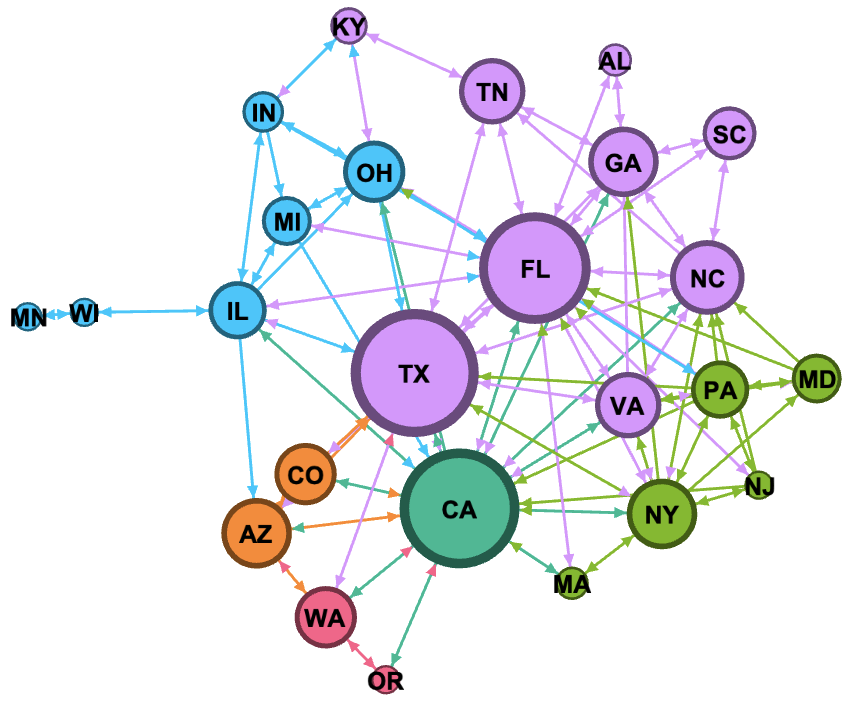
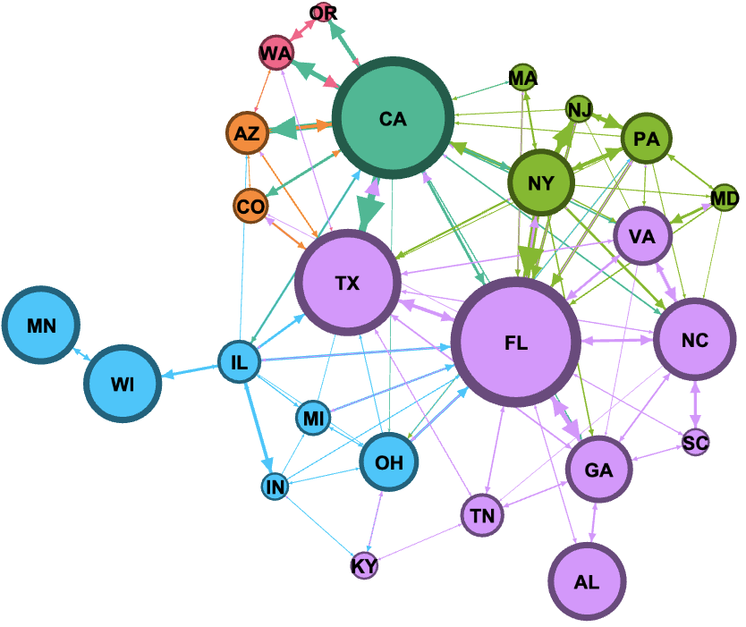

# Blue South 2020

## Visualization 1: Population Movement

### Bar Graph: State Net Migration

### Bar Graph: Top County Movements

### Choropleth: Net Migration

### Network Analysis 
State to state migration, representing the "inflow" amounts from state to state, rather than net migration. The network was filtered to include only inflows that were >= 10,000 and states that have 2 or more inflows of that size

#### Version 1: Unweighted:

#### Version 2: Weighted:

### State to State Migration Map

### County to County Migration Map

This is a very large data set. To make it more intelligible visually, I made several adjustments: only included positive migration into Southern states, omitted movement between counties within the South

Even so, the resulting map had 32,466 connections. I then made two filtered maps - one with the top 10% of county migrations (~3,300) and one with the top 1% (~330). You can see all three versions below

#### Option 1: all migration to southern counties

#### Option 2: top 10% of migration to southern counties

#### Option 3: top 1% of migration to southern counties

